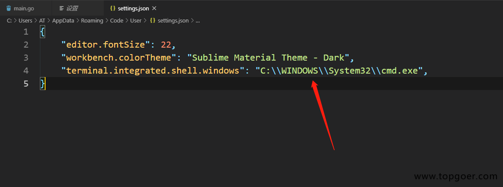

## 0x1. Windows安装vs code

`Visual Studio Code`，简称`VS Code`，它是目前使用人数最多的编辑器。尽管它由微软发布于2015年，与其他热门编辑器相比显得有些年轻，但它在过去几年中一直在不停的更新，它在最新的`Stack Overflow`调查中被选为`Web`开发人员中最受欢迎的文本编辑器。

`VS Code`不仅仅是一个基本的代码编辑器。有人说它更像是`IDE`而不是代码编辑器，因为它提供了许多通常只在`IDE`中才有的功能。主要功能包括内置调试工具，智能代码提示，集成终端以及对简易的`Git`操作（微软刚收购了`GitHub`）。作为初学者，您可以利用这些功能大大提高编程效率。

在 `VS Code`中找到的每个功能都完成一项出色的工作，构建了一些简单的功能集，包括语法高亮、智能补全、集成 `git` 和编辑器内置调试工具等，将使你开发更高效。

下载地址：https://code.visualstudio.com/

选择windows版本下载，vscode有新版本时候会自动更新，重启即可更新。

傻瓜式安装一直下一步就好了！

## 0x2.配置

### 01 修改代理

在后续安装tools时，失败时可以尝试修改代理

```go
go env -w GOPROXY=https://goproxy.cn,direct
```

### 02 安装go插件

启动`vscode`选择插件->搜`go`选择`Go for Visual Studio Code`插件点击安装即可。

### 03 安装Go语言开发工具包

在Go语言开发的时候为我们提供诸如代码提示、代码自动补全等功能。

Windows平台按下`Ctrl+Shift+P`，Mac平台按`Command+Shift+P`，这个时候`VS Code`界面会弹出一个输入框，如下图：


我们在这个输入框中输入>`go:install`，下面会自动搜索相关命令，我们选择`Go:Install/Update Tools`这个命令


选中并会回车执行该命令（或者使用鼠标点击该命令）


VS Code此时会下载并安装上图列出来的16个工具，但是由于国内的网络环境基本上都会出现安装失败

解决方法见 01.

## 0x3 修改vscode终端cmd启动

在运行代码的时候需要终端运行，有的小伙伴终端默认的是powershell，有的直接默认是cmd，如果你的是powershell需要修改为cmd，如果默认的就是cmd直接放弃这块就好了


1.在文件 -> 首选项 -> 设置中打开settings页面, 搜索shell或则找到Terminal>Integrated>Shell:Windows,




添加`"terminal.integrated.shell.windows": "C:\\WINDOWS\\System32\\cmd.exe",` 后面的地址是你的cmd地址