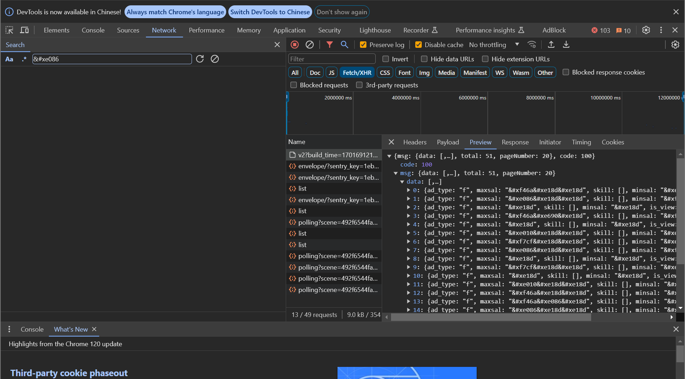

# 01-字体反爬-shixiseng

前言：

练习字体反爬

## 1、网站分析

网站：

`YUhSMGNITTZMeTkzZDNjdWMyaHBlR2x6Wlc1bkxtTnZiUzlwYm5SbGNtNXpQM0JoWjJVOU1TWjBlWEJsUFdsdWRHVnliaVpyWlhsM2IzSmtQU1ZGTkNWQ1FTVkJOeVZGTlNVNU15VTRNU1poY21WaFBTWnRiMjUwYUhNOU1TWmtZWGx6UFNaa1pXZHlaV1U5Sm05bVptbGphV0ZzUFNabGJuUmxjbkJ5YVhObFBTWnpZV3hoY25rOUxUQW1jSFZpYkdsemFGUnBiV1U5Sm5OdmNuUlVlWEJsUFNaamFYUjVQU1ZGTlNVNE5TVkJPQ1ZGTlNVNVFpVkNSQ1pwYm5SbGNtNUZlSFJsYm1ROQ==`



页面中关于，薪资浮动区间等值，是以`&#xf46a&#xe18d&#xe18d`等符号展示


在页面中可以找到如上样式，点击到具体的css文件目录


找到文件后，直接搜索class关键字`myFont`可以找到对应的字体文件。

然后下载字体文件，使用软件http://www.fontcreator.com/打开


即可看到对应的字体信息。

## 2、还原字体信息

安装所需包

```python
pip install fontTools
```

读取字体信息，显示

```python
f_obj = TTFont('file')
m_dict = f_obj.getBestCmap()
logger.debug(m_dict)
# 输出信息如下，可以看到字体的对应关系
"""
{120: 'x', 57346: 'uni36', 57368: 'uni66', 57471: 'uni94F6', 57477: 'uni69', 57494: 'uni50', 57632: 'uni56', 57775: 'uni43', 57827: 'uni4E09', 57883: 'uni74', 58043: 'uni54', 58053: 'uni65', 58099: 'uni71', 58110: 'uni34', 58248: 'uni78', 58313: 'uni45', 58331: 'uni8054', 58340: 'uni5E7F', 58435: 'uni5468', 58514: 'uni64', 58683: 'uni7F51', 58690: 'uni8F6F', 58696: 'uni51', 58794: 'uni8BA1', 58839: 'uni4f', 58841: 'uni72', 58887: 'uni57', 59096: 'uni79', 59212: 'uni7A0B', 59285: 'uni6a', 59364: 'uni68', 59401: 'uni77', 59492: 'uni75', 59562: 'uni4E8C', 59587: 'uni4a', 59594: 'uni4E92', 59837: 'uni6e', 59889: 'uni524D', 59982: 'uni884C', 60038: 'uni46', 60055: 'uni7AEF', 60065: 'uni653F', 60143: 'uni4e', 60203: 'uni42', 60248: 'uni544A', 60322: 'uni44', 60341: 'uni8D22', 60352: 'uni67', 60362: 'uni56DB', 60414: 'uni32', 60630: 'uni53', 60639: 'uni73', 60646: 'uni38', 60742: 'uni6d', 60782: 'uni37', 60958: 'uni62DB', 61021: 'uni31', 61050: 'uni59', 61106: 'uni58', 61139: 'uni63', 61149: 'uni573A', 61208: 'uni7a', 61235: 'uni48', 61253: 'uni5a', 61315: 'uni76', 61324: 'uni62', 61370: 'uni751F', 61376: 'uni61', 61388: 'uni49', 61402: 'uni6c', 61469: 'uni4E2A', 61483: 'uni4d', 61505: 'uni4EBA', 61551: 'uni4c', 61597: 'uni4F5C', 61623: 'uni4F1A', 61633: 'uni8BBE', 61726: 'uni55', 62008: 'uni6f', 62019: 'uni30', 62048: 'uni6708', 62070: 'uni70', 62098: 'uni5E08', 62107: 'uni4E00', 62113: 'uni6b', 62171: 'uni4b', 62221: 'uni5DE5', 62375: 'uni5929', 62382: 'uni33', 62397: 'uni8058', 62431: 'uni4EF6', 62502: 'uni47', 62543: 'uni41', 62656: 'uni35', 62799: 'uni4E94', 62866: 'uni5E02', 63477: 'uni39', 63479: 'uni5E74', 63613: 'uni52'}
"""

```

对于文中`&#xf46a&#xe18d&#xe18d`

可以看出单个字体的变化关系如下：


同时需要将uni36转码,并且将字体map信息存入字典当中备用

```python
    def convert(self):
        f_obj = TTFont('file')
        m_dict = f_obj.getBestCmap()
        logger.debug(m_dict)
        for k, v in m_dict.items():
            if v.startswith('uni'):
                if len(v) < 7:
                    self.font[hex(k)] = ('\\u00' + v[3:]).encode().decode('unicode_escape')
                else:
                    self.font[hex(k)] = ('\\u' + v[3:]).encode().decode('unicode_escape')
        logger.debug(self.font)
```

编写json中每个值得转换逻辑

```python
        def convert_font(jd: dict):
            for k, v in jd.items():
                # logger.debug(str(type(v)))
                if 'dict' in str(type(v)):
                    jd[k] = convert_font(v)
                elif 'list' in str(type(v)):
                    temp = []
                    for s in v:
                        if 'dict' in str(type(s)):
                            temp.append(convert_font(s))
                        # elif 'list' in str(type(s)):
                        #     temp.append(s)
                        elif 'str' in str(type(s)) and '&#' in s:
                            temp.append(self.secret2mw(s))
                        else:
                            temp.append(s)
                    jd[k] = temp
                elif 'str' in str(type(v)):
                    temp = v
                    if "&#" in v:
                        temp = self.secret2mw(v)
                    # logger.debug(temp)
                    jd[k] = temp
            return jd
```

完整代码如下

```python
import os
from collections import defaultdict
from copy import deepcopy

import requests
from fontTools.ttLib import TTFont
from loguru import logger


class Shixisheng:
    def __init__(self, keywords):
        self.keywords = keywords
        self.font = defaultdict(str)
        self.get_font_file()
        self.convert()

    def get_font_file(self):
        headers = {
            "authority": "www.shixiseng.com",
            "accept": "*/*",
            "accept-language": "zh-CN,zh;q=0.9,en-US;q=0.8,en;q=0.7",
            "cache-control": "no-cache",
            "origin": "https://www.shixiseng.com",
            "pragma": "no-cache",
            "referer": "https://www.shixiseng.com/interns?page=1&type=intern&keyword=^%^E4^%^BA^%^A7^%^E5^%^93^%^81&area=&months=1&days=&degree=&official=&enterprise=&salary=-0&publishTime=&sortType=&city=^%^E5^%^85^%^A8^%^E5^%^9B^%^BD&internExtend=",
            "sec-ch-ua": "^\\^Not_A",
            "sec-ch-ua-mobile": "?0",
            "sec-ch-ua-platform": "^\\^Windows^^",
            "sec-fetch-dest": "font",
            "sec-fetch-mode": "cors",
            "sec-fetch-site": "same-origin",
            "user-agent": "Mozilla/5.0 (Windows NT 10.0; Win64; x64) AppleWebKit/537.36 (KHTML, like Gecko) Chrome/120.0.0.0 Safari/537.36"
        }
        cookies = {
            "utm_source_first": "PC",
            "__jsluid_s": "1d0de6ed5446d1e00cbc58f99a0f2383",
            "utm_source": "PC",
            "utm_campaign": "PC",
            "position": "pc_default",
            "Hm_lvt_03465902f492a43ee3eb3543d81eba55": "1701686622,1701691205",
            "Hm_lpvt_03465902f492a43ee3eb3543d81eba55": "1701691205"
        }
        url = "https://www.shixiseng.com/interns/iconfonts/file"
        params = {
            "rand": "0.8195871590231047"
        }
        response = requests.get(url, headers=headers, cookies=cookies, params=params)

        if response.status_code == 200:
            open('file', mode='wb').write(response.content)
        # print(response.text)
        # print(response)

    def convert(self):
        f_obj = TTFont('file')
        m_dict = f_obj.getBestCmap()
        logger.debug(m_dict)
        for k, v in m_dict.items():
            if v.startswith('uni'):
                if len(v) < 7:
                    self.font[hex(k)] = ('\\u00' + v[3:]).encode().decode('unicode_escape')
                else:
                    self.font[hex(k)] = ('\\u' + v[3:]).encode().decode('unicode_escape')
        logger.debug(self.font)

    def get_position_info_raw_data(self):

        for keyword in self.keywords:
            headers = {
                "authority": "www.shixiseng.com",
                "accept": "application/json, text/plain, */*",
                "accept-language": "zh-CN,zh;q=0.9,en-US;q=0.8,en;q=0.7",
                "cache-control": "no-cache",
                "content-type": "application/x-www-form-urlencoded",
                "pragma": "no-cache",
                "referer": "https://www.shixiseng.com/interns?keyword=%E4%BA%A7%E5%93%81&city=%E5%85%A8%E5%9B%BD&type=intern&from=menu",
                "sec-ch-ua": "\"Not_A Brand\";v=\"8\", \"Chromium\";v=\"120\", \"Google Chrome\";v=\"120\"",
                "sec-ch-ua-mobile": "?0",
                "sec-ch-ua-platform": "\"Windows\"",
                "sec-fetch-dest": "empty",
                "sec-fetch-mode": "cors",
                "sec-fetch-site": "same-origin",
                "user-agent": "Mozilla/5.0 (Windows NT 10.0; Win64; x64) AppleWebKit/537.36 (KHTML, like Gecko) Chrome/120.0.0.0 Safari/537.36"
            }
            cookies = {
                "utm_source_first": "PC",
                "__jsluid_s": "1d0de6ed5446d1e00cbc58f99a0f2383",
                "utm_source": "PC",
                "utm_campaign": "PC",
                "position": "pc_default",
                "Hm_lvt_03465902f492a43ee3eb3543d81eba55": "1701686622,1701691205",
                "Hm_lpvt_03465902f492a43ee3eb3543d81eba55": "1701691205"
            }
            url = "https://www.shixiseng.com/app/interns/search/v2"
            params = {
                "build_time": "1701691219259",
                "page": "1",
                "type": "intern",
                "keyword": keyword,
                "area": "",
                "months": "1",
                "days": "",
                "degree": "",
                "official": "",
                "enterprise": "",
                "salary": "-0",
                "publishTime": "",
                "sortType": "",
                "city": "全国",
                "internExtend": ""
            }
            response = requests.get(url, headers=headers, cookies=cookies, params=params)

            logger.debug(response.json())
            if response.status_code == 200:
                yield response.json()

    def secret2mw(self, v: str):
        # logger.debug(v)
        res = []
        # logger.debug(v.split("&#"))
        for s in v.split("&#"):
            if s:
                # logger.debug('0' + s)
                res.append(self.font['0' + s])
        return "".join(res)

    def get_position_info(self):
        def convert_font(jd: dict):
            for k, v in jd.items():
                # logger.debug(str(type(v)))
                if 'dict' in str(type(v)):
                    jd[k] = convert_font(v)
                elif 'list' in str(type(v)):
                    temp = []
                    for s in v:
                        if 'dict' in str(type(s)):
                            temp.append(convert_font(s))
                        # elif 'list' in str(type(s)):
                        #     temp.append(s)
                        elif 'str' in str(type(s)) and '&#' in s:
                            temp.append(self.secret2mw(s))
                        else:
                            temp.append(s)
                    jd[k] = temp
                elif 'str' in str(type(v)):
                    temp = v
                    if "&#" in v:
                        temp = self.secret2mw(v)
                    # logger.debug(temp)
                    jd[k] = temp
            return jd

        ans = []
        for data in self.get_position_info_raw_data():
            ans.append(deepcopy(data))
            ans.append(convert_font(data))

        logger.debug(ans)


if __name__ == '__main__':
    sxs = Shixisheng(['产品', 'Python'])
    sxs.get_position_info()

```

