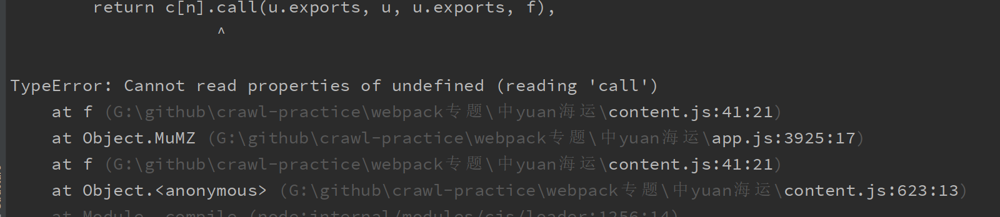

# Webpack 练习专题 01

前言：

练习webpack 逆向


## 1、网站分析

网站`YUhSMGNITTZMeTl6ZVc1amIyNW9kV0l1WTI5elkyOXphR2x3Y0dsdVp5NWpiMjB2eHV6aGlmeHV6aGlmDQo=`


通过分析可知，登陆请求需要以下参数

```json
params = {
    "FECU": "8Lxcf5ADJ6bRiyAr0LR9yUX5DsYrSNA6a/skpauFFfZeSjbh2k0Fs4b45LvEqB1Ffk57xQ+XW215j0pG2AXuNogMmD551LWXPJlEy0hmjZMMTjZtJweKRHjFsIn6aTi+J6FmLll/zSff5z4mlniR19kcy5oPAgLeeOTNwIvp0c9NFqUBgYQfZC6DUT9hCCfL41"
}
data = {
    "username": "test",
    "password": "Iz1d05p7YI1+AY+xW+WLhnLBbmqpiC0tSA3gZ0VVwxyfS6gdZF0scjLPlZyd1nq1Fc22rBtGcCV1cBcA+jl4rqdDc4frW6NVqc5P6SG3+mhpARwDUGiuGz/SeuIj3mgs2aYu5x9p4KAhGj9zANg0MK2mcMAVNdiWcg0g1hZgy3YR2rwimJ40EYZJu4r8eLoV2ZiGRlk0aG6Ja7z1q2iFrrQYVdIb0ANaYf1MzFJc5gQa5ZUSbUgb07agCWhvAFx2jbM7LICBTSpV56IqN4+4pKMOuARdNsOLmlmPiEE0PeWDmM5hlchg+t3ChH5hutQJp0OGStszYIqaUOScEzvAMQ==",
    "captcha": "54645",
    "": ""
}
```

其中需要逆向的参数为

- "FECU"
  - 需要逆向，本次主要学习webpack，下次再解
- "password"
  - 这次逆向的主角

## 2、确定加密参数，定位

通过上面分析，我们需要解决password的加密算法


通过启动器，给出的文件位置，每个尝试可以得出以下可疑位置


其中password加密为`password: Object(o.a)(t),`

其中的o为 `o = n("MuMZ")`

至此定位结束，可以得到我们需要得到的函数为`n("MuMZ")`


**总结以下webpack特征**：

- n函数，传入数字或者字符串
- 文件名包含chunk
- 文件开头有webpackJsonp

## 3、逆向加密参数

通过以上特征可以得出该网站属于webpack类型

**webpack解决方法：**

- 抠出加载器
- 模块

### 3.1 定位加载器（loader）

#### **查看启动器，所有的文件，是否有自启动函数**


未找到加载器

#### 查看source界面，所有的js文件


在查看的过程中检索关键字`webpackJsonp`

在`index`中发现自启动函数，确定启动器，将启动代码抠出放入文件`index.js`

注意该文件在`html`中`JS`代码在`<script> </script>`中，别找错代码，不能全部复制

至此加载器，获取完成。

### 3.2 确定所需模块，加载

通过以上定位我们得知加密函数在`app.js`中，可知这个模块是我们需要的，将此模块的代码全部拷贝，访问本地`app.js`中，

运行报错，



将在报错位置添加`console.log(c)`

可以看出我们想要的函数并没有，应该是模块没有加载完全，

通过分析启动器所涉及的模块，全部加载。

- app.js
- chunk-lib.js

```js
require("./app.js")
require("./chunk-lib.js")
```


### 3.3 组装

通过以上分析我们得到了以下js文件

- index.js
  - loader
- app.js
  - model
- chunk-lib.js
  - model

我们需要在loader中加载模块,并且定义 `fff01`存储其中的`n`函数也就是`f`

`index.js`

```js
window = global
var fff01 = null
require("./app.js")
require("./chunk-lib.js")

...

 f.oe = function(c) {
        throw c
    };
 fff01 = f;
 var d = window.webpackJsonp = window.webpackJsonp || [],
 b = d.push.bind(d);
 
 ...
 
function encodePassword(password) {
    return fff01("MuMZ").a(password)
}

```


得到加密结果