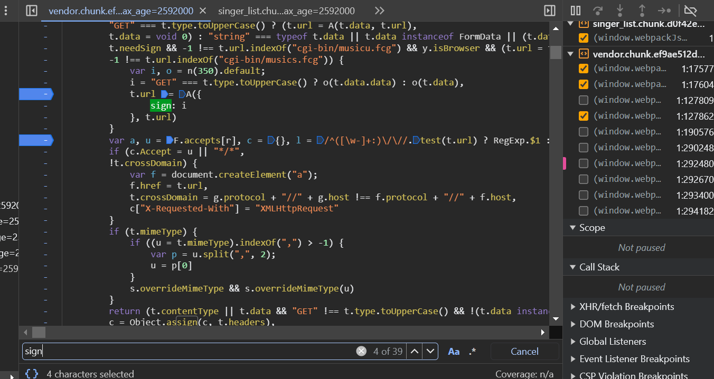
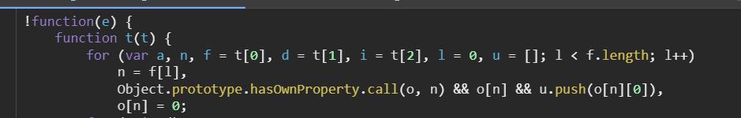
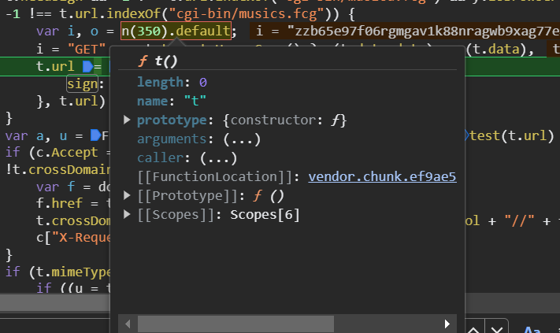

# 某QMusic JS逆向

**前言：**

学习webpack


## 1、网站分析

### 背景

获取所有歌手，歌曲，歌词信息

### 获取思路

获取所有歌手 - > 所有歌手的歌


在歌手查询页面，打开开发者调试工具，查询歌手名称，可以找到如图接口，对response进行分析，可以的到所有的歌手信息都在sigerlist中，


歌手信息接口：`aHR0cHM6Ly91LnkucXEuY29tL2NnaS1iaW4vbXVzaWNzLmZjZw==`

## 2、参数分析


```python
params = {
    "_": "1700928356959",
    "sign": "zzb65e97f06rgmgav1k88nragwb9xag77e40543"
}
data = {
    "comm": {
        "cv": 4747474,
        "ct": 24,
        "format": "json",
        "inCharset": "utf-8",
        "outCharset": "utf-8",
        "notice": 0,
        "platform": "yqq.json",
        "needNewCode": 1,
        "uin": 744971047,
        "g_tk_new_20200303": 5381,
        "g_tk": 5381
    },
    "req_1": {
        "module": "music.musichallSinger.SingerList",
        "method": "GetSingerListIndex",
        "param": {
            "area": -100,
            "sex": -100,
            "genre": -100,
            "index": 1,
            "sin": 0,
            "cur_page": 1
        }
    }
}
```

经过分析可知：

- "_"
  - 13位时间搓
  - `int(time.time()*1000)`
  - 可以忽略，不修改也能请求
- "sign"
  - 需要逆向生成

data中的参数，通过切换不同歌手的检索信息分析可知

- index
  - 1-27
  - 为A-Z的开头的歌手
- 其余参数保持不变

## 3、参数Sign逆向生成

由上文可知，需要逆向的参数为sign，以及接口信息，通过initiator进行定位


定位到源文件后，可以直接搜索关键字sign



通过对以上代码分析，可知入参为`t.data`,加密函数为`o`

- t.data
  - 为上文分析的data
- o
  - n(350).default

在此处打上断点，查看n以及n(350).default分别是什么


**n**

定位到如下函数


可以得出该函数就是n，为了后续封装方便，我们定义全局变量，fsign等于改s方法

```js
var fsign = null

....

f.p = "/ryqq/",
f.oe = function(e) {
      throw e
  }
fsign = f;
var d = window.webpackJsonp = window.webpackJsonp || []
, i = d.push.bind(d);
```


通过n(350)以及文件名中的'chunk'可以得出属于webpack类型。

对于webpack我们需要抠出加载器，以及其中的模块，

**加载器特征：有个匿名自启动函数**




通过以上开头和结尾的分析，符合加载器的特征，将加载整个代码复制出，放入runtime.js文件中

**n(350).default**



根据以上加载器和模块在不同文件，可以得出是多文件的webpack，将该文件js全部考出，作为vendor.js

然后在加载器中导入该模块

```js
// 导入方法
require('./vendor')
```


为了方便调用封装如下方法,可以放在文件的最外层

```js
function getSign(data){
    let o = fsign(350).default
    return o(data)
}
```

检测，输入和网页相同搞的参数，得出的sign不同

一般出现如上情况，大概率是环境检测

补上比较常见的环境

- document
- navigator
- window
- location

以上环境可以在浏览器command出，查看复制出来即可


以下是完整代码

```js
var fsign = null
window = self = global
require('./vendor')
//document = {}
navigator = {
appCodeName: "Mozilla",
appName: "Netscape",
appVersion: "5.0 (Windows NT 10.0; Win64; x64) AppleWebKit/537.36 (KHTML, like Gecko) Chrome/119.0.0.0 Safari/537.36",
userAgent: "Mozilla/5.0 (Windows NT 10.0; Win64; x64) AppleWebKit/537.36 (KHTML, like Gecko) Chrome/119.0.0.0 Safari/537.36"
}
location = {
    "ancestorOrigins": {},
    "href": "https://y.qq.com/n/ryqq/singer_list?index=1&genre=-100&sex=-100&area=-100",
    "origin": "https://y.qq.com",
    "protocol": "https:",
    "host": "y.qq.com",
    "hostname": "y.qq.com",
    "port": "",
    "pathname": "/n/ryqq/singer_list",
    "search": "?index=1&genre=-100&sex=-100&area=-100",
    "hash": ""
}
```

完工


**备注：文章仅供学习用途，如有侵权，请联系删除**