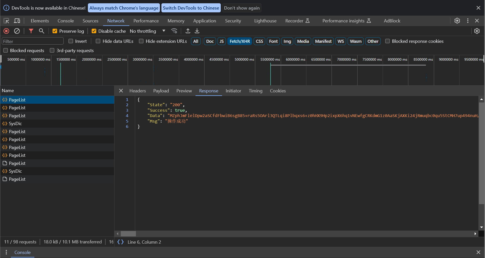
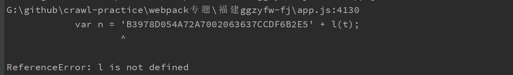
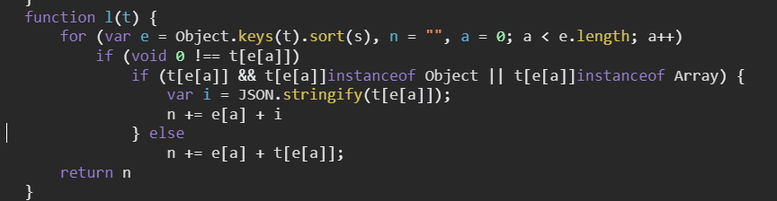
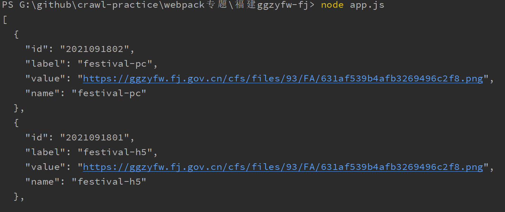

# Webpack 练习专题 02

前言：

练习webpack 逆向


## 1、网站分析

网站：`YUhSMGNITTZMeTluWjNwNVpuY3VabW91WjI5MkxtTnVMMmx1WkdWNEwyNWxkMHhwYzNRdlAzUjVjR1U5TVRNPQ==`

通过刷新页面可以看到返回的data是加密参数，需要还原。



观察header


通过不同的请求header对比可以确定`Portal-Sign`是需要逆向的参数


需要逆向的参数分别是：

- header
  - `Portal-Sign`
- response
  - `data`

## 2、加密位置定位

[注] 本网站通过启动器无法定位加解密位置。

**定位方法**

### 2.1 **header加密，搜索关键字**

从需要的参数入手，可以观察到header需要加密的名称为`Portal-Sign`, 直接搜索关键字


可以确定`Portal-Sign`的加密函数为`f.getSign(e)`, 打断点，查看函数具体内容，方便下一步还原。

### 2.2 **response解密，搜索关键字`JSON.parse`**


可以确定`data`的解密函数为`b(e.data)`, 打断点，查看函数具体内容，方便下一步还原。


## 3、逆向加密参数

### 3.1 `Portal-Sign`还原

第一步在入口位置打断点


查看具体函数， 可以得出函数为如下


抠出该函数

```js
 function d(t) {
            for (var e in t)
                "" !== t[e] && void 0 !== t[e] || delete t[e];
            var n = r["a"] + l(t);
            return u(n).toLocaleLowerCase()
        }
```

其中r["a"]是常量


直接替换，运行



`l`未定义，查看函数位置上下文，查找`l`



```js
 function l(t) {
            for (var e = Object.keys(t).sort(s), n = "", a = 0; a < e.length; a++)
                if (void 0 !== t[e[a]])
                    if (t[e[a]] && t[e[a]]instanceof Object || t[e[a]]instanceof Array) {
                        var i = JSON.stringify(t[e[a]]);
                        n += e[a] + i
                    } else
                        n += e[a] + t[e[a]];
            return n
        }
        function d(t) {
            for (var e in t)
                "" !== t[e] && void 0 !== t[e] || delete t[e];
            var n = 'B3978D054A72A7002063637CCDF6B2E5' + l(t);
            return u(n).toLocaleLowerCase()
        }
```

在运行发现`s`不存在，继续查看上下文，抠出`s`

```js
function s(t, e) {
            return t.toString().toUpperCase() > e.toString().toUpperCase() ? 1 : t.toString().toUpperCase() == e.toString().toUpperCase() ? 0 : -1
        }

function l(t) {
            for (var e = Object.keys(t).sort(s), n = "", a = 0; a < e.length; a++)
                if (void 0 !== t[e[a]])
                    if (t[e[a]] && t[e[a]]instanceof Object || t[e[a]]instanceof Array) {
                        var i = JSON.stringify(t[e[a]]);
                        n += e[a] + i
                    } else
                        n += e[a] + t[e[a]];
            return n
        }
function d(t) {
  for (var e in t)
     "" !== t[e] && void 0 !== t[e] || delete t[e];
    var n = 'B3978D054A72A7002063637CCDF6B2E5' + l(t);
     return u(n).toLocaleLowerCase()
 }
```

运行提示`u(n)`不存在，接着抠出`u`

```js
function s(t, e) {
            return t.toString().toUpperCase() > e.toString().toUpperCase() ? 1 : t.toString().toUpperCase() == e.toString().toUpperCase() ? 0 : -1
        }

function l(t) {
            for (var e = Object.keys(t).sort(s), n = "", a = 0; a < e.length; a++)
                if (void 0 !== t[e[a]])
                    if (t[e[a]] && t[e[a]]instanceof Object || t[e[a]]instanceof Array) {
                        var i = JSON.stringify(t[e[a]]);
                        n += e[a] + i
                    } else
                        n += e[a] + t[e[a]];
            return n
        }
function d(t) {
    var u = n("8237");
  for (var e in t)
     "" !== t[e] && void 0 !== t[e] || delete t[e];
    var n = 'B3978D054A72A7002063637CCDF6B2E5' + l(t);
     return u(n).toLocaleLowerCase()
 }
```

其中`n("8237")`符合webpack特征，需要用到webpack的模块`'8237'`,在文件中检索，然后相关模块导入

**webpack还原方法**

- 扣加载器
  - 自启动函数
- 模块
  - `window["webpackJsonp"]`开头

通过对于网站的观察,该网站一共有三个js文件，其中app是启动器。


组装webpack

文件结构如下，新建如下三个文件，分别将网页中js复制到以下文件中

- app.js
- chunk.js
- chunk-lib.js

在启动器中，将`n`也就是启动器分配函数，保存到全局变量，方便后续使用

```js
window = global
var loader_
require('./chunk');
require('./chunk-vendor');

···
var f = l;
o.push([0, "chunk-vendors"]),
loader_ = u
...

```

整个webpack模块加载完成，后续data还原也可以用这个webpack代码

，然后完善上面代码

```js
function s(t, e) {
            return t.toString().toUpperCase() > e.toString().toUpperCase() ? 1 : t.toString().toUpperCase() == e.toString().toUpperCase() ? 0 : -1
        }

function l(t) {
            for (var e = Object.keys(t).sort(s), n = "", a = 0; a < e.length; a++)
                if (void 0 !== t[e[a]])
                    if (t[e[a]] && t[e[a]]instanceof Object || t[e[a]]instanceof Array) {
                        var i = JSON.stringify(t[e[a]]);
                        n += e[a] + i
                    } else
                        n += e[a] + t[e[a]];
            return n
        }
function d(t) {
    var u = loader_("8237");
  for (var e in t)
     "" !== t[e] && void 0 !== t[e] || delete t[e];
    var n = 'B3978D054A72A7002063637CCDF6B2E5' + l(t);
     return u(n).toLocaleLowerCase()
 }
```

测试运行成功


### 3.2 `data`还原

在data还原入口处，打断点，查看具体函数


扣出以下代码

```js
function b(t) {
            var e = h.a.enc.Utf8.parse(r["e"])
              , n = h.a.enc.Utf8.parse(r["i"])
              , a = h.a.AES.decrypt(t, e, {
                iv: n,
                mode: h.a.mode.CBC,
                padding: h.a.pad.Pkcs7
            });
            return a.toString(h.a.enc.Utf8)
        }
```

然后运行，缺什么补什么，基本上都在该函数上面位置,

```js
function getResponse(t) {
        var p = loader_("3452")
        var h = loader_.n(p);
        var e = h.a.enc.Utf8.parse('EB444973714E4A40876CE66BE45D5930')
              , n = h.a.enc.Utf8.parse('B5A8904209931867')
              , a = h.a.AES.decrypt(t, e, {
                iv: n,
                mode: h.a.mode.CBC,
                padding: h.a.pad.Pkcs7
            });
            return a.toString(h.a.enc.Utf8)
}
```

其中的loader_，是上一个参数还原的webpack启动器，两个参数可以通用，测试结果



**备注：文章仅供学习用途，如有侵权，请联系删除**