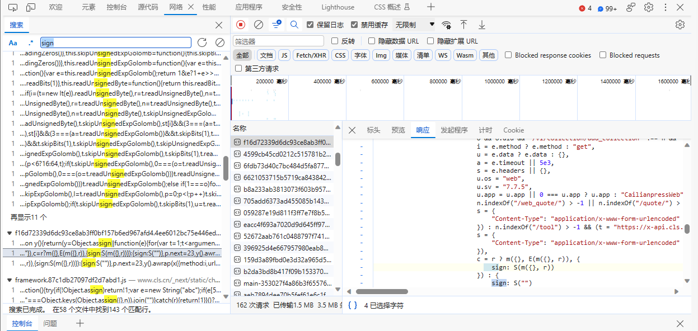
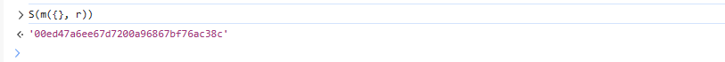
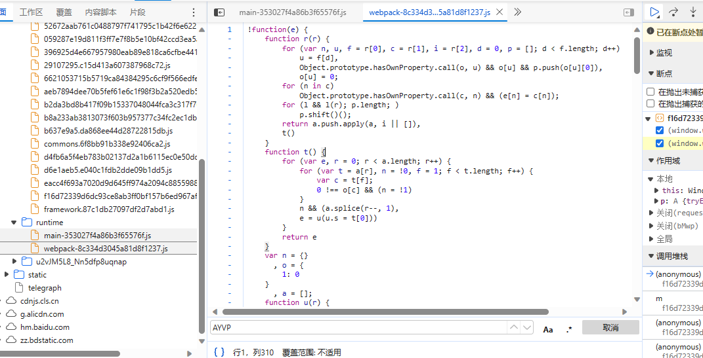
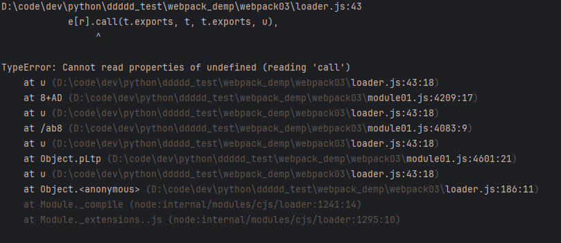
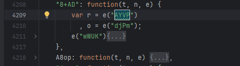
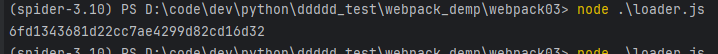

# 05-webpack-practice03

前言：

练习webpack 逆向

## 1、网站分析

网站：

`YUhSMGNITTZMeTkzZDNjdVkyeHpMbU51TDNSbGJHVm5jbUZ3YUE9PQ==`

分析接口参数，确定加密参数


`sign`通过对比多次请求，可以确定是加密参数

## 2、加密位置定位

搜索关键字`sign`



打断点，查看S函数返回值



可以确定加密位置

## 3、逆向sign生成

在加密位置打断点，查看S函数


抠出代码

```js
function(e) {
   var t = e && f(c(e).map((function(t) {
   	return p(t, e[t])
   }
   )));
   return t = i.sync(t),
   t = u(t)
}
```

然后查看改函数中，未定义的部分

- f
- c
- p
- i
- u

在上下文中找到找到这个定义，并将代码抠出


```js
var r =  o = n("pLtp")
          , i = n("KjvB")
          , u = n("aCH8")
function s(e) {
            return String(e)
        }
function c(e) {
            return o(e).sort()
        }
function f(e) {
            return e.filter((function(e) {
                return e
            }
            )).join("&")
        }
function p(e, t) {
            var n = typeof t
              , o = null;
            return t === o ? o = a ? o : "".concat(s(e), "=").concat(o) : /string|number|boolean/.test(n) ? o = "".concat(s(e), "=").concat(s(t)) : r(t) ? o = function(e, t) {
                return t.length ? f(t.map((function(t, n) {
                    return p("".concat(e, "[").concat(n, "]"), t)
                }
                ))) : s("".concat(e, "[]"))
            }(e, t) : "object" === n && (o = function(e, t) {
                return f(c(t).map((function(n) {
                    return p("".concat(e, "[").concat(n, "]"), t[n])
                }
                )))
            }(e, t)),
            o
        }
function(e) {
   var t = e && f(c(e).map((function(t) {
   	return p(t, e[t])
   }
   )));
   return t = i.sync(t),
   t = u(t)
}
```

通过`n("pLtp")`可以确定webpack特征，其中n为loader

找到启动器，和模块，进行webpack组装

**启动器**

- 查看所有的js文件，查找自启动方法



可以找到如上，webpack启动器，将全部代码放入`loader.js`,定义全局变量，保存其中的n，方便后续使用。

**模块**

- 先加入加密函数所在模块，然后将刚刚抠出的函数放在启动器文件的模块，运行



出现该错误，则是模块为导入完全，根据报错位置，



挨个文件搜索该关键字，然后将其模块代码全部复制出来，放到module01.js中，在加载器中导入。

一直添加，直到没有报错信息。

最终代码如下

```js
var i = loader_("KjvB")
    , o = loader_("pLtp")
          , u = loader_("aCH8")

function s(e) {
            return String(e)
        }
function c(e) {
            return o(e).sort()
 }

function f(e) {
            return e.filter((function(e) {
                return e
            }
            )).join("&")
        }
function p(e, t) {
            var n = typeof t
              , o = null;
            return t === o ? o = a ? o : "".concat(s(e), "=").concat(o) : /string|number|boolean/.test(n) ? o = "".concat(s(e), "=").concat(s(t)) : r(t) ? o = function(e, t) {
                return t.length ? f(t.map((function(t, n) {
                    return p("".concat(e, "[").concat(n, "]"), t)
                }
                ))) : s("".concat(e, "[]"))
            }(e, t) : "object" === n && (o = function(e, t) {
                return f(c(t).map((function(n) {
                    return p("".concat(e, "[").concat(n, "]"), t[n])
                }
                )))
            }(e, t)),
            o
}

function getSign(e) {
    var t = e && f(c(e).map((function(t) {
                return p(t, e[t])
            }
            )));
            return t = i.sync(t),
            t = u(t)
}

let e = {
    "lastTime": 1701264805,
    "os": "web",
    "sv": "7.7.5",
    "app": "CailianpressWeb"
}

console.log(getSign(e))
```



成功输出结果

**备注：文章仅供学习用途，如有侵权，请联系删除**